# 学生证管理系统

### 1.题目名称
学生证管理系统

### 2.题目要求
请设计一个学生证的管理程序。该程序应该具有下列功能：
> * 1．录入某位学生的学生证信息(学生证包含的信息参看自己的学生证)；
> * 2．给定学号，显示某位学生的学生证信息；
> * 3．给定某个班级的班号，显示该班所有学生的学生证信息；
> * 4．给定某位学生的学号，修改该学生的学生证信息；
> * 5．给定某位学生的学号，删除该学生的学生证信息；

### 3.概要设计方案	
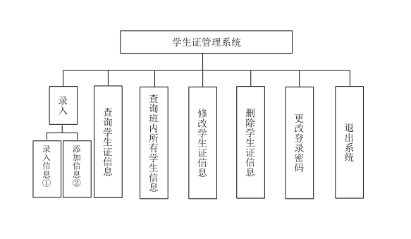
> 注：
> * ① 录入学生证信息（将会重写源文件信息）
> * ②	在原基础上添加学生证信息

### 4.详细设计方案
> * 1．登录密码
> * 2．录入学生证信息
> * 3．查询学生证信息
> * 4．查询班级内所有学生信息
> * 5．修改学生证信息
> * 6．删除学生证信息
> * 7．更改密码
> * 8．退出系统

### 5.测试数据： 
源代码的压缩包中附带有软件12班的学生信息，用于测试系统运行是否正常。

### 6.测试功能截图
图为：密码验证  
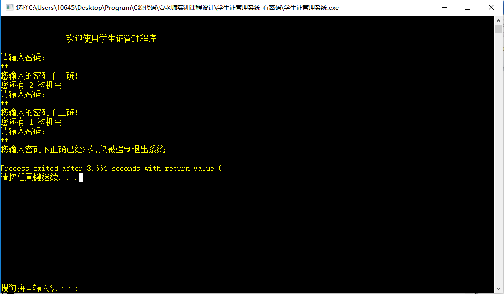  
图为：主菜单  
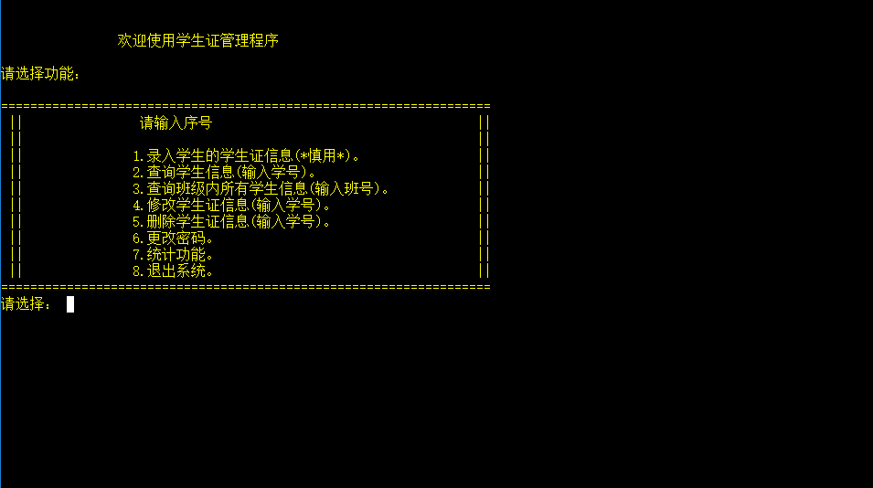  
图为：子菜单  
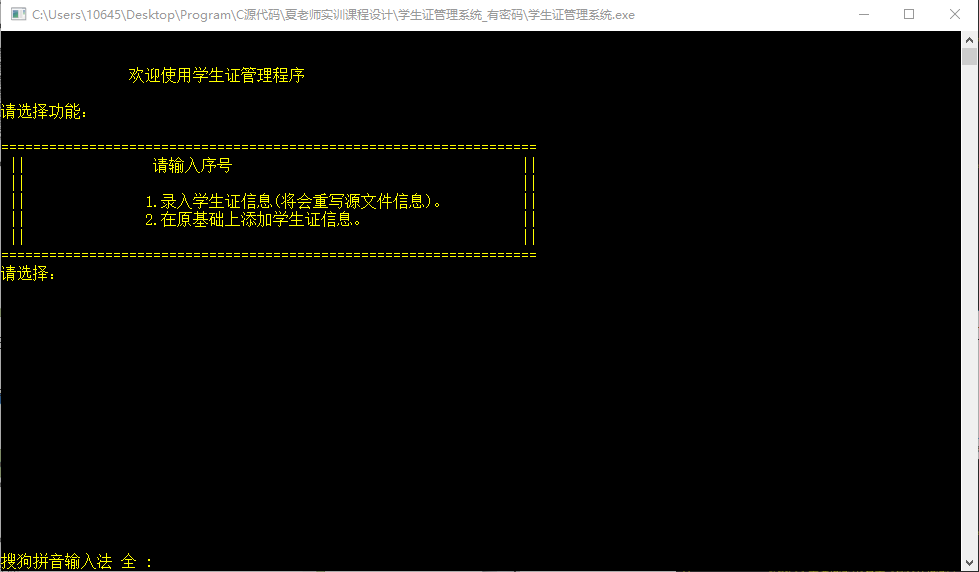  
图为：查询学生信息  
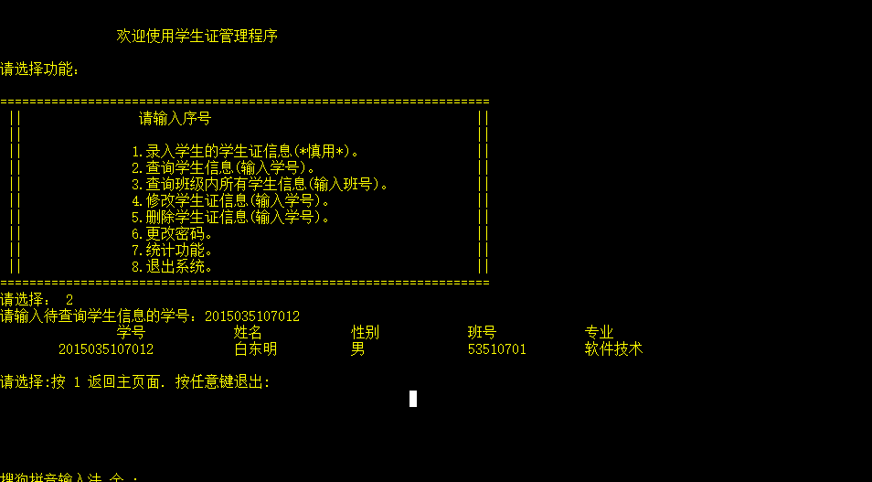  
图为：添加学生信息  
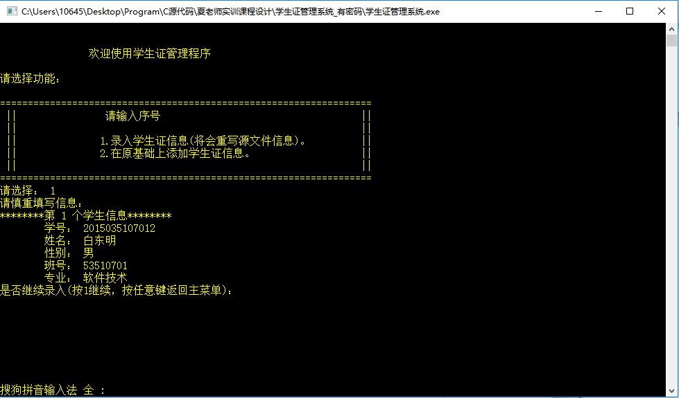  
图为：查询班级内所有学生信息  
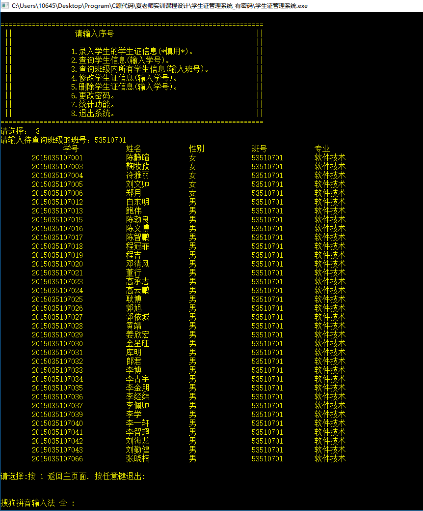  
图为：修改学生信息  
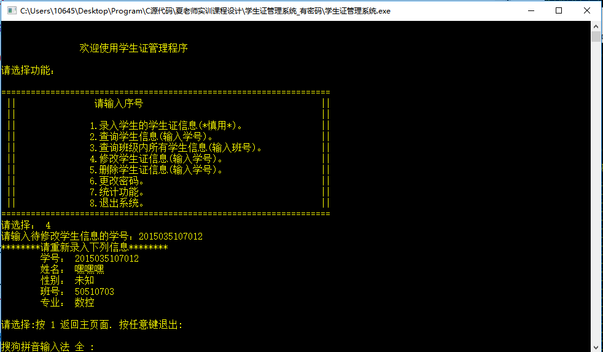  
图为：删除学生信息  
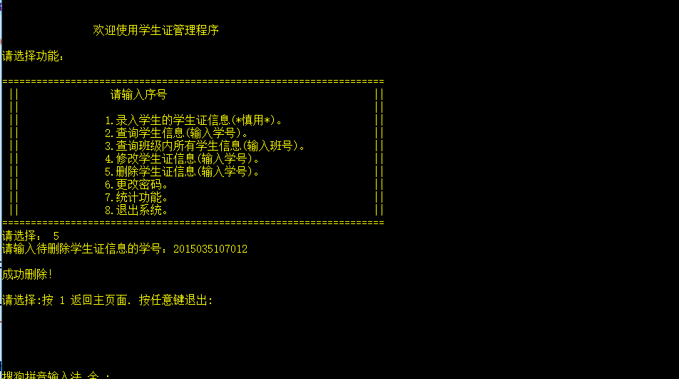  
图为：更改密码  
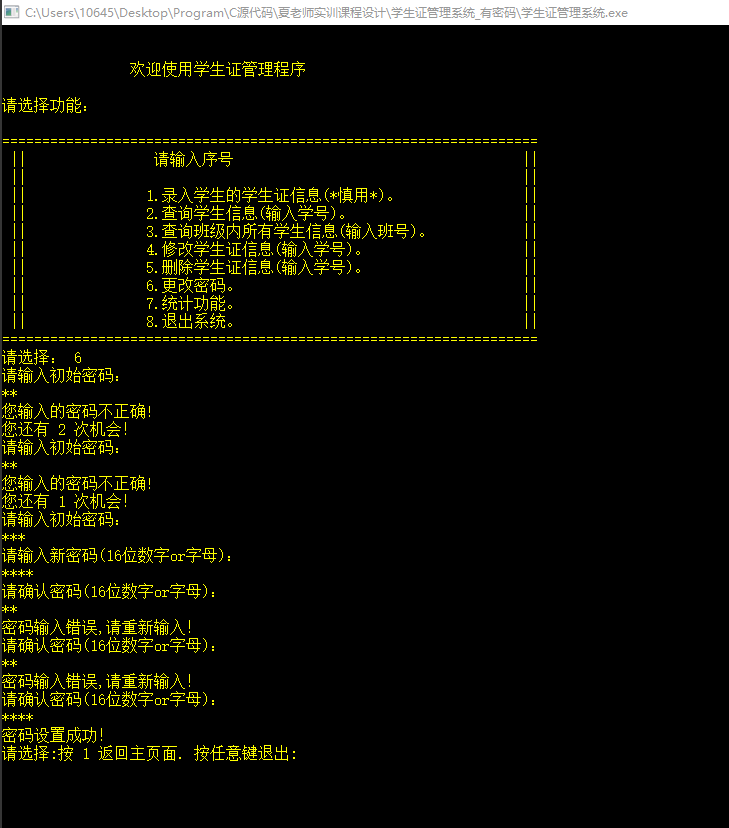  
图为：退出系统  
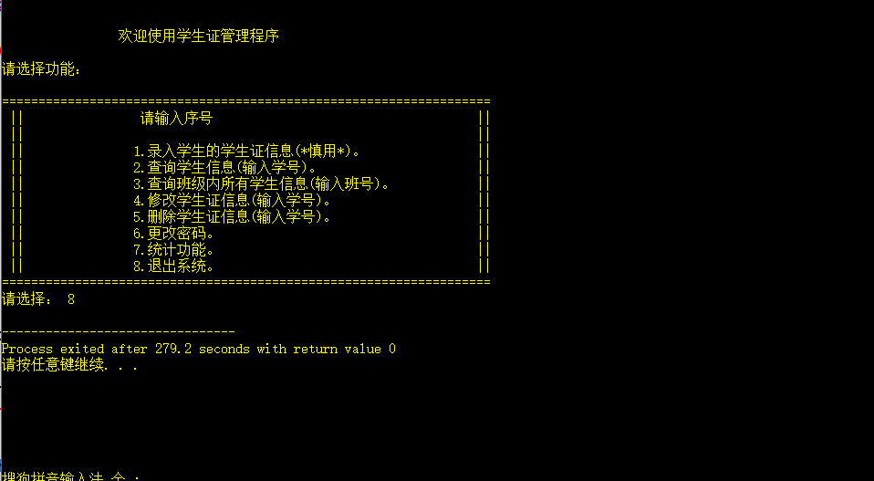