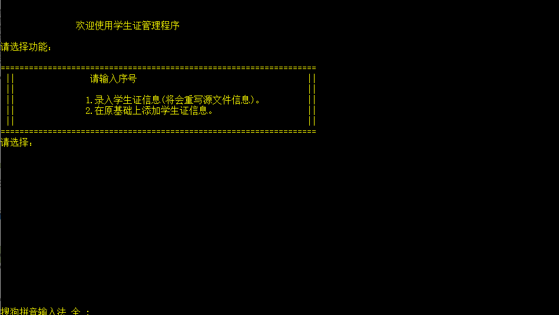
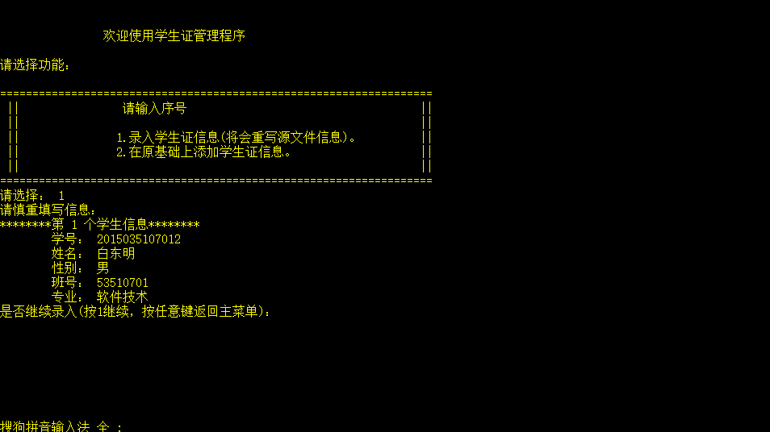
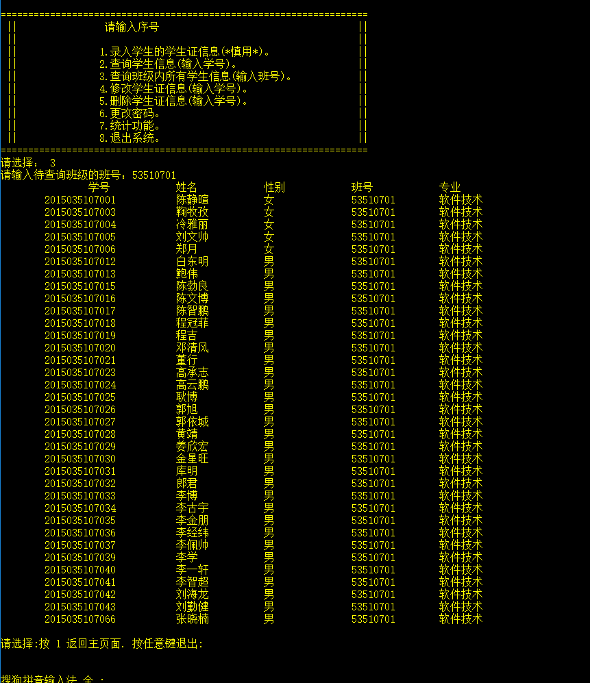
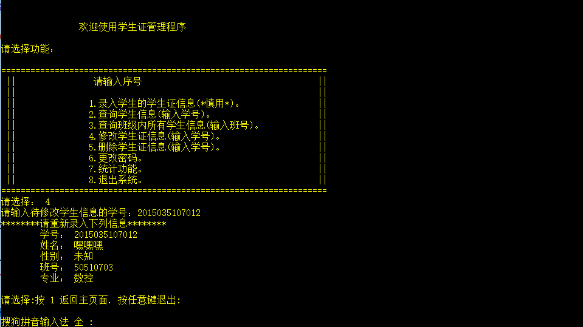
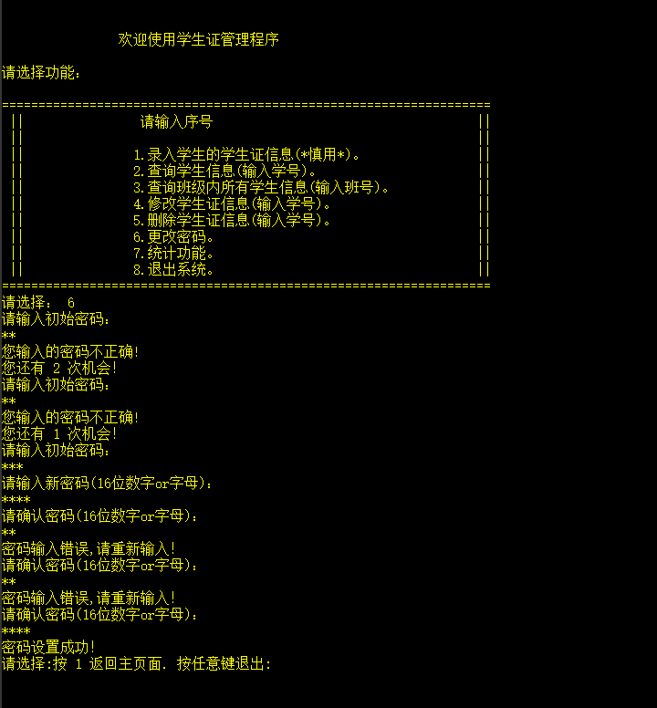

# 学生证管理系统

## 题目名称
学生证管理系统

## 题目要求
请设计一个学生证的管理程序。该程序应该具有下列功能：
* 1) 录入某位学生的学生证信息(学生证包含的信息参看自己的学生证)；
* 2) 给定学号，显示某位学生的学生证信息；
* 3) 给定某个班级的班号，显示该班所有学生的学生证信息；
* 4) 给定某位学生的学号，修改该学生的学生证信息；
* 5) 给定某位学生的学号，删除该学生的学生证信息；

## 概要设计方案	
注：
* ① 录入学生证信息（将会重写源文件信息）
* ②	在原基础上添加学生证信息

## 详细设计方案
* 1．登录密码
* 2．录入学生证信息
* 3．查询学生证信息
* 4．查询班级内所有学生信息
* 5．修改学生证信息
* 6．删除学生证信息
* 7．更改密码
* 8．退出系统

## 测试数据： 
源代码的压缩包中附带有软件12班的学生信息，用于测试系统运行是否正常。

## 测试功能截图
密码验证

主菜单

子菜单

查询学生信息

添加学生信息

查询班级内所有学生信息

修改学生信息

删除学生信息

更改密码

退出系统

